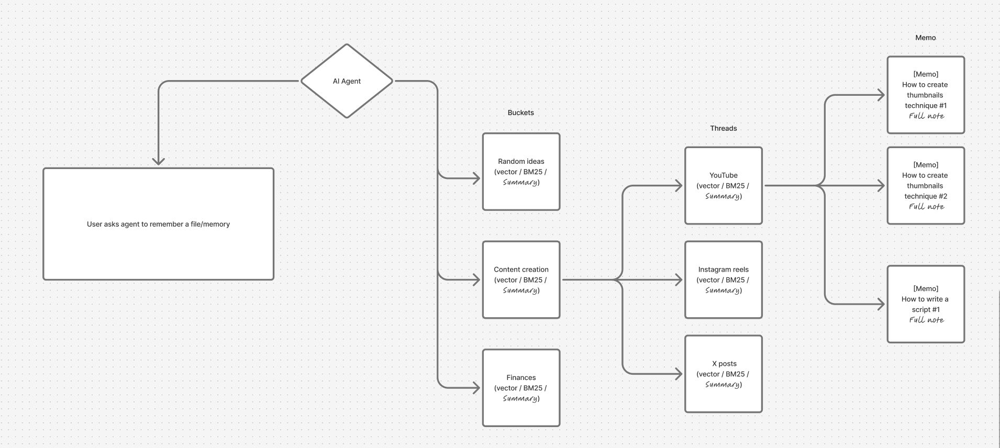
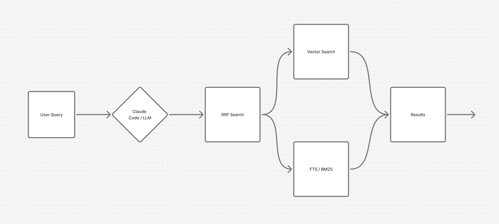
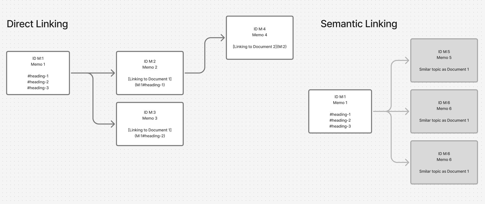

Please read this [Version file](./documentations/VERSION1.0.0.md#summary-maintenance)

```
  ███╗   ███╗███████╗███╗   ███╗███╗   ███╗ ██████╗ ██╗  ████████╗
  ████╗ ████║██╔════╝████╗ ████║████╗ ████║██╔═══██╗██║  ╚══██╔══╝
  ██╔████╔██║█████╗  ██╔████╔██║██╔████╔██║██║   ██║██║     ██║
  ██║╚██╔╝██║██╔══╝  ██║╚██╔╝██║██║╚██╔╝██║██║   ██║██║     ██║
  ██║ ╚═╝ ██║███████╗██║ ╚═╝ ██║██║ ╚═╝ ██║╚██████╔╝███████╗██║
  ╚═╝     ╚═╝╚══════╝╚═╝     ╚═╝╚═╝     ╚═╝ ╚═════╝ ╚══════╝╚═╝
```

# MemMolt

> **Structured, searchable, long-term memory for your AI agent.**
> Plugs into Claude Code (and any MCP-compatible client) over the Model Context Protocol.

---

## What is MemMolt?

MemMolt is a memory system for AI agents. Think of it as a brain extension for Claude Code
that remembers things across conversations, keeps them tidy, and can recall them by meaning — not just keywords.

It lives on your machine as a tiny local server. Your agent connects to it, reads from it, writes to it, and picks up where it left off the next time you open a conversation.

Memory is organized into three simple layers:

```
  BUCKET      →    top-level category        ("Personal Finances")
    │
    └── THREAD   →    sub-topic              ("Quarterly Taxes")
          │
          └── MEMO   →    the actual note    ("Q3 estimated payment notes")
```

That's it. Buckets hold threads. Threads hold memos. Memos are markdown documents.
No nested folders, no wiki rabbit holes, no broken links.

---

## What problem does it solve?

If you've used an AI agent for a while, you've probably hit one of these:

- **"It forgot what we talked about yesterday."**
- **"I keep re-explaining the same context every session."**
- **"My notes folder has grown into a jungle I can't navigate."**
- **"The agent wastes half its context window reading old notes."**

MemMolt fixes all four. The agent only pulls in the memos it actually needs,
organized so it knows where to look, indexed so it can find them by *meaning* and not just word match.

---

## Why not just use Claude Code + Obsidian (or any notes folder)?

A plain notes folder works — until it doesn't. Here's what you trade away:

| Problem | Plain notes folder | MemMolt |
|---|---|---|
| **Finding things** | Text search only. Miss the exact word, miss the note. | **Hybrid search**: keyword (FTS5) + meaning (vector embeddings) combined via **RRF** so you get both. |
| **Organization** | Folders can be nested arbitrarily, links break, stuff drifts. | **Enforced 3-level hierarchy**. The agent can't make a mess because the structure doesn't allow one. |
| **Context window** | Agent reads multiple full files just to check if they're relevant. | Agent searches summaries first, fetches only the memos it actually needs. Massively fewer tokens. |
| **Spiraling out** | Long notes get longer, topics sprawl across files. | Summaries force compression. Each memo has a forced title + summary that must describe what it contains. |
| **Consistency** | The agent might remember to update notes, or it might not. | The tool *prompts* the agent to update summaries after changes. Built-in nudges keep memory fresh. |
| **Search across topics** | Manual. You grep, you browse, you hope. | One call returns results from the whole system, ranked by relevance. |

**Short version:** A notes folder is a *filesystem*. MemMolt is a *memory system*.

---

## How it works (the quick version)

- Everything lives in **one SQLite file** on your disk (default: `~/.memmolt/memmolt.sqlite` — see [Configuration](#configuration) for the full resolution order).
- Summaries are turned into vectors by a local embedding model (**all-MiniLM-L6-v2**, runs in-process, no cloud calls).
- Search combines keyword matching (**FTS5**) and semantic matching (**sqlite-vec**), then merges them with **Reciprocal Rank Fusion (RRF)**.
- The agent talks to MemMolt over **MCP** (Model Context Protocol) — the same way Claude Code talks to any other tool.

No separate database server. No subprocess management. No cloud dependencies. One file, one process.

### How the memory is organized

When the agent is asked to remember something, it routes the information through the enforced Bucket → Thread → Memo hierarchy:



The AI agent picks the right bucket (or creates one), picks the right thread under it, then writes a memo. Every level carries its own vector + BM25 summary, so search can start from any level.

### How search works

Used for **memo, thread, and bucket** searches — same pipeline at every level:



The query runs through **both** a vector search (semantic similarity on the summary embedding) and an FTS5 / BM25 search (keyword matching). The two ranked lists are merged via **Reciprocal Rank Fusion (RRF)** to produce the final result set. Anything that ranks well in either approach — or both — bubbles to the top.

### How memos interlink

Individual memos don't live in isolation. Once a memo exists, MemMolt gives the agent two ways to traverse the memo graph from it:



**Direct linking** — the agent writes cross-references directly in a memo's Markdown, using standard link syntax:

```markdown
The foundations are in [Color theory basics](M:1#heading-2).
See also the [full intro](M:1).
```

You can point at a whole memo (`M:1`) or at a specific heading inside it (`M:1#heading-2`). Headings can be written in their natural form — `[x](M:1#My Section)` — and the server normalizes them to GitHub-style slugs (`#my-section`) at save time, so the agent never has to slugify anything. Links inside fenced code blocks or inline code are left alone, and external links like `[doc](./file.md)` are ignored. On every `fetch_memos` call, these refs are resolved to `{ memo_id, heading, memo_title, memo_summary }` so the agent sees exactly where each link points.

**Semantic linking** — on every fetch, MemMolt also runs a vector KNN pass over the fetched memo's own embedding and returns up to **5 semantically similar memos** (cosine similarity ≥ 0.5) in the response. No query, no keyword match — just "what else in your memory is *about* this thing." It's how the agent discovers context that *should* have been linked but wasn't, or material that was captured before the linking concept existed.

Together these two feed the same field on `fetch_memos`: the agent reads a memo and immediately sees (a) the memos this one *explicitly* points at and (b) the memos that are *implicitly* related. From there it can iterate — follow a link, fetch that memo, see its links and neighbors, keep going. The memo graph becomes navigable in both the human-curated direction and the automatic one.

---

## How fast is it?

Benchmarked on a realistic dataset of **1,000 memos** across 10 buckets and 50 threads, measured over **10,000 hybrid search queries**:

| Operation | Avg latency | p95 | p99 | Throughput |
|---|---|---|---|---|
| `search_bucket` (hybrid FTS5 + vec + RRF) | **5.35 ms** | 7.03 ms | 8.57 ms | 187 ops/sec |
| `search_memos` (hybrid FTS5 + vec + RRF) | **11.14 ms** | 15.06 ms | 19.63 ms | 90 ops/sec |
| `search_thread` (hybrid FTS5 + vec + RRF) | **14.08 ms** | 17.96 ms | 24.12 ms | 71 ops/sec |

That's **single-digit-to-low-teens millisecond hybrid search** at every level of the hierarchy — keyword matching, semantic matching via a 384-dim vector model, and RRF fusion all in roughly the time it takes a human eye to blink.

Re-run the numbers on your own machine:

```bash
npm run benchmark
```

See `benchmark/` for full methodology and the latest committed run.

---

## Design principle: stay lightweight

MemMolt is designed to be **fast, small, and forgettable**. You shouldn't notice it running.

- **No dedicated dev server.** It's a single Node process you start with `npm start`.
- **No background daemons.** No Redis, no Postgres, no vector DB subprocess.
- **No network chatter.** All search and embedding happens in-process, on your machine.
- **No memory bloat.** One SQLite file on disk + one small transformer model in RAM (loaded lazily, only when first used).
- **Fast startup.** The full test suite (127 tests with a real DB) finishes in ~5 seconds. The server itself boots in well under a second.

If a feature would require a separate service, a heavy dependency, or would noticeably slow things down, we'd rather not add it. The whole point is that MemMolt should **just work in the background** without ever being the bottleneck — of your machine, your workflow, or your agent's context window.

---

## Getting started

### Install

```bash
git clone https://github.com/rituraj-io/MemMolt.git
cd MemMolt
npm install
```

### Run

```bash
npm start
```

You should see:

```
MemMolt MCP server running on http://localhost:3100
  SSE endpoint:      http://localhost:3100/sse
  Messages endpoint: http://localhost:3100/messages
  Health endpoint:   http://localhost:3100/health
```

That's it. The server is running.

### Connect to Claude Code

You have two scopes to choose from:

- **User scope (global)** — MemMolt is available in *every* Claude Code project. Recommended for personal memory that spans everything you do.
- **Project scope (local)** — MemMolt is available only inside this one project folder. Useful if you want separate memory per project.

And two transports:

- **stdio** *(recommended)* — Claude Code starts and stops MemMolt automatically per session. Zero setup, always available.
- **HTTP/SSE** — you run `npm start` yourself; multiple sessions share one server, DB state survives Claude Code restarts.

---

#### Global setup with stdio (recommended for most users)

Edit `~/.claude.json` (on Windows: `C:\Users\<you>\.claude.json`). Find the **top-level** `"mcpServers"` object (not the one inside a per-project entry) and add:

```json
"mcpServers": {
  "memmolt": {
    "type": "stdio",
    "command": "node",
    "args": ["/absolute/path/to/MemMolt/index.js", "--stdio"]
  }
}
```

Replace `/absolute/path/to/MemMolt` with the actual folder path. Windows paths work too — use forward slashes: `"E:/codes/MemMolt/index.js"`.

Save the file, fully quit and restart Claude Code. Done.

#### Global setup with HTTP/SSE

Same file as above, but entry:

```json
"memmolt": {
  "type": "sse",
  "url": "http://localhost:3100/sse"
}
```

Then run `npm start` in the MemMolt folder before launching Claude Code. Leave it running in the background.

#### Project-scoped setup

Create `.mcp.json` in the root of the project where you want MemMolt available:

```json
{
  "mcpServers": {
    "memmolt": {
      "type": "stdio",
      "command": "node",
      "args": ["/absolute/path/to/MemMolt/index.js", "--stdio"]
    }
  }
}
```

Claude Code picks it up automatically when you launch it in that folder.

### Verify the connection

After restarting Claude Code:

1. Run `/mcp` inside Claude Code — you should see `memmolt` listed as connected.
2. Ask: *"What memory tools do you have?"* — it should list 16 MemMolt tools (status, search_memos, create_bucket, etc).
3. Try: *"Remember that my favorite color is blue."* — the agent will create a bucket, thread, and memo. Then in a new conversation: *"What's my favorite color?"* — it will search MemMolt and recall it.

**First-run note:** The very first search or create triggers the embedding model download (~90 MB, `all-MiniLM-L6-v2`, cached to disk). Subsequent calls are instant. You'll only pay this cost once per machine.

**Plugin install note:** If you installed MemMolt via `/plugin install memmolt@memmolt`, the first time the MCP server starts it will run `npm install` automatically (~30 seconds) to fetch native dependencies. Claude Code may briefly show *"Failed to reconnect"* during this one-time step — restart Claude Code once and it will connect normally.

### Troubleshooting

| Symptom | Fix |
|---|---|
| `memmolt` doesn't appear in `/mcp` | Make sure you edited the **top-level** `mcpServers` in `~/.claude.json`, not one of the nested per-project ones. Fully quit and relaunch Claude Code. |
| "Failed to connect to MCP server memmolt" | Path in `args` is wrong or file doesn't exist. Verify `node /absolute/path/to/MemMolt/index.js --stdio` works from a terminal. |
| Tool calls hang on first use | First embedding model download is in progress (~90 MB). Give it a minute; subsequent calls are instant. |
| Port 3100 already in use (HTTP/SSE only) | Either something else is using 3100, or another MemMolt instance is already running. Set `MEMCLAW_PORT=3200 npm start` to change it and update the URL in your config. |

---

## What the agent can do

MemMolt exposes 16 MCP tools. The agent doesn't need you to understand these — it figures out when to use which one — but here's the full catalog:

### System
- `status` — health check, counts per entity

### Search
- `search_memos` — find memos by query (optionally scoped to a bucket or thread)
- `search_bucket` — find buckets
- `search_thread` — find threads
- `fetch_memos` — pull full content for a list of memo IDs, plus the memos they link to (direct) and the memos semantically nearest to them (semantic)

### Create
- `create_bucket` — new top-level category
- `create_thread` — new sub-topic under a bucket
- `create_memo` — new document under a thread; content may cross-link other memos with `[text](M:<id>)` or `[text](M:<id>#heading)`

### Update
- `update_bucket` — rename or re-describe a bucket
- `update_thread` — rename or re-describe a thread
- `update_memo` — update title, summary, or content of a memo
  - Supports **line-level edits** so the agent doesn't have to resend huge content blobs

### Delete (all cascade where appropriate)
- `delete_bucket` — deletes the bucket and everything inside it
- `delete_thread` — deletes the thread and its memos
- `delete_memo` — deletes a single memo

### Reorganize
- `move_thread` — move a thread to a different bucket
- `move_memo` — move a memo to a different thread

Every tool response includes an **`agent_guidance`** field where relevant — small nudges like *"consider updating the parent bucket summary"* that keep the memory graph coherent over time.

---

## Tech stack (for the curious)

| Layer | Technology |
|---|---|
| Runtime | Node.js |
| Storage | SQLite (via `better-sqlite3`) |
| Keyword search | SQLite FTS5 (BM25 ranking) |
| Vector search | `sqlite-vec` extension (384-dim embeddings) |
| Embedding model | `all-MiniLM-L6-v2` via `@xenova/transformers` (local, in-process) |
| Search fusion | Reciprocal Rank Fusion (RRF) |
| Protocol | Model Context Protocol (MCP) |
| Transports | HTTP/SSE (default) + stdio |

Everything runs locally. No API keys required. No data leaves your machine.

---

## For developers

### Project layout

```
memmolt/
├── database/
│   ├── sqlite.js           # SQLite connector + sqlite-vec loader
│   └── tables/init.sql     # Schema (tables, FTS5, vec0, triggers)
├── functions/
│   ├── memory/             # Domain logic (buckets, threads, memos)
│   ├── mcp/                # MCP tool handlers (thin wrappers)
│   └── utils/              # Embedder, RRF, vector sync, orphan cleanup, FTS sanitizer
├── tests/                  # Jest unit tests
├── documentations/         # Version specs
├── docs/                   # Internal plans & design docs
├── index.js                # Entry point
└── README.md
```

### Commands

```bash
npm start                   # Run the server (HTTP/SSE, port 3100)
node index.js --stdio       # Run with stdio transport
npm test                    # Jest test suite (127 tests)
npm run test:watch          # Jest in watch mode
npm run test:coverage       # Tests with coverage report
npx tsc --noEmit            # Type check (JSDoc + TS compiler)
```

### Configuration

| Env var | Default | Description |
|---|---|---|
| `MEMMOLT_PORT` | `3100` | HTTP/SSE port. |
| `MEMMOLT_DB_PATH` | *(resolved — see below)* | Path to the SQLite file. Use `:memory:` for tests. |

**Default DB path resolution** (first match wins):

1. `MEMMOLT_DB_PATH` env var, if set.
2. `${CLAUDE_PLUGIN_DATA}/memmolt.sqlite` — when running as a Claude Code plugin. This is a persistent per-plugin data directory set by Claude Code; **user memory survives plugin updates and reinstalls**.
3. `<repo>/.db/memmolt.sqlite` — when running from a cloned git checkout (`.git` is present), so contributors running `npm start` locally still get the in-repo `.db/` workflow.
4. `~/.memmolt/memmolt.sqlite` — safe default for `npm install -g memmolt` and everything else. Never inside any plugin cache.

### What runs on startup

1. SQLite opens, `sqlite-vec` extension loads, schema creates (idempotent).
2. **Orphan cleanup sweep** — removes any dangling vectors or unreferenced rows left behind by crashes or manual edits.
3. MCP server starts on the chosen transport.

### Testing philosophy

Unit tests cover all pure functions in `functions/memory/` and `functions/utils/`.
The MCP wrappers are thin routing layers and aren't covered by unit tests directly — if the domain functions work, the wrappers do too.

Tests use an in-memory SQLite database and a deterministic mocked embedder, so the full suite runs in ~5 seconds.

---

## License

[MIT](./LICENSE) — do whatever you want with it, just keep the copyright notice.

---

*Memory is only useful if it's current. Check it before you answer. Update it when you learn. Don't let it drift out of date.*
